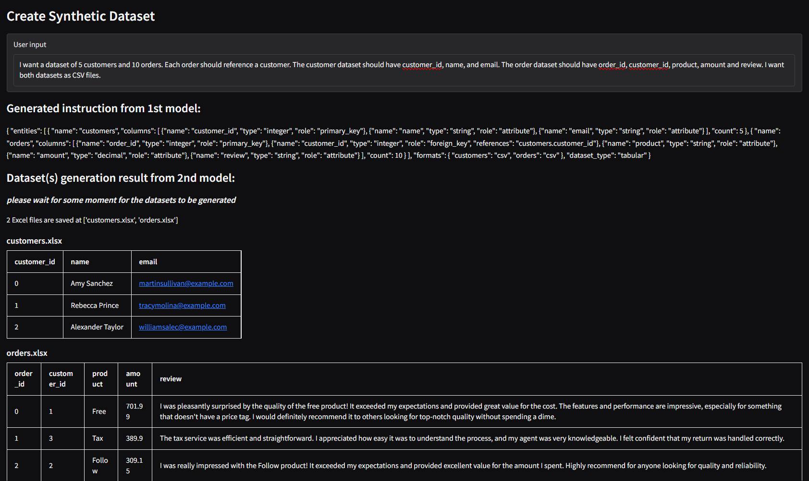
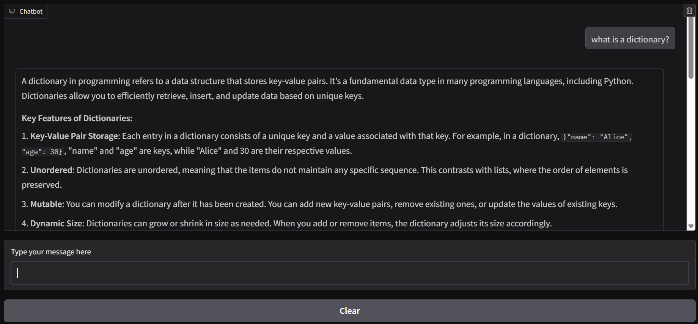
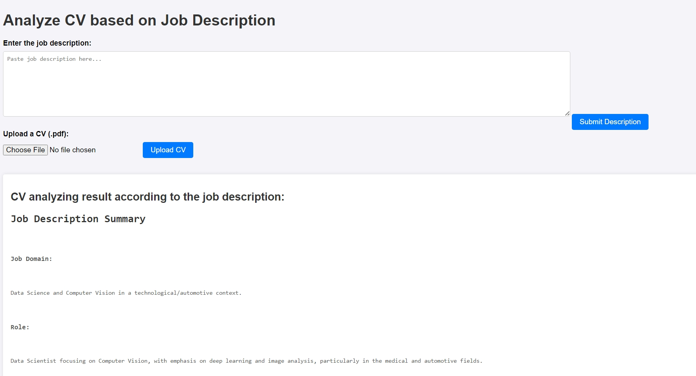
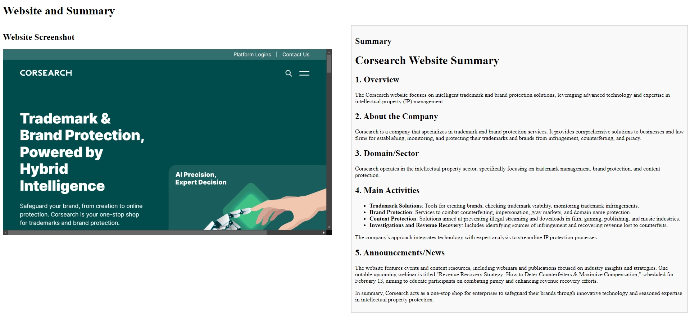

# LLM Tools

This is a repository with different tools that use LLM to perform tasks like website summarizing, cover letter writing (from the resume and job description), etc.

## Table of Contents
- [Synthetic dataset generator](#synthetic-dataset-generator)
- [AI tutor](#ai-tutor)
- [CV analyzer based on Job Description](#cv-analyzer-based-on-job-description)
- [Website summarizer](#website-summarizer)

## Important note
Pretty much all of the tools use APIs to call models from OpenAI or Anthropic. If the API call is for a closed-source model, the user must have an API key and some credit in his/her account.

<u>Example:</u> for OpenAI API, one should go to https://platform.openai.com/ to top up some amount into her account and set up an API key.

However, there will be some tools using free, local, open-source models like Llama3.2, in that case, model using won't cost any credit.

## Setup
Currently, using anaconda to set up the environment is recommended. To do so, run:
```
conda env create -f environment.yml
```

Then before using each tool, please activate the environment by:
```
conda activate llms
```

As mentioned above, API key is required to run the tools, so one must create a .env in the root directory. **The filename must be exactly .env**. Then copy the API key into it.

For examle: for OpenAI API key, create this line in .env file:
```
OPENAI_API_KEY=API_KEY_goes_here
```
## Synthetic dataset generator
### Note
*This tool is still under development, so that the code is still in draft mode and will be refactored in the future. Furthermore, this tool will possibly have bugs, so please create an issue if you find any.*

*For this moment, this can only create tabular dataset(s) under excel format.*

**<u>Usage:</u>**

```
python .\Synthetic-data-creator\create_datasets.py
```
This tool generates synthetic dataset(s) from the user input, which specifies the business problem, requirements and the dataset details.

**Example input**: I want a dataset of 5 customers and 10 orders. Each order should reference a customer. The customer dataset should have customer_id, name, and email. The order dataset should have order_id, customer_id, product, amount and review. I want both datasets as CSV files.

This tool is helpful when there is a need for adding fake data into your database for model training.

The result should be somehthing like this:


## AI tutor
**<u>Usage:</u>**

```
python Simple-AI-tutor/ai_tutor.py --model_name gpt-4o-mini|llama3.2|deepseek-r1:1.5b|etc. --api_key ollama(if specify open-source models in --model_name)
```
This tool generates a chat interface that mimics well-known chat interfaces like ChatGPT that can answer your questions or messages.

The result should be somehthing like this:


## CV analyzer based on Job Description
**<u>Usage:</u>**

```
python CV-Job-analyzer/web_summarize.py --model_name gpt-4o-mini|llama3.2|deepseek-r1:1.5b|etc. --api_key ollama(if specify open-source models in --model_name)
```
As its name, this tool will give you the ability to paste in a job description and upload a CV in pdf. 

It will then analyze the CV according to the job description and the output some interesting results: 

- Job description summary
- Identification of skill matches and lackings
- Comparison of keywords between the CV and the job description
- Possible CV improvements
- Good-fit scoring
- Tailored feedbacks
- Insights on the market trends of that job domain

The result should be somehthing like this:


## Website summarizer
**<u>Usage:</u>**

```
python Web-summarizer/web_summarize.py website_url_goes_here --model_name gpt-4o-mini|llama3.2|deepseek-r1:1.5b|etc. --api_key ollama(if specify open-source models in --model_name)
```
As its name, this tool will analyze and summarize the content of a (public) website using **GPT-4o-mini** model. Using GPT-4o-mini means that the tool requires you to have a positive credit in the OpenAI API account, but it will charge you a very very small amount of your credit for every time the tool is called.

The result should be somehthing like this:


